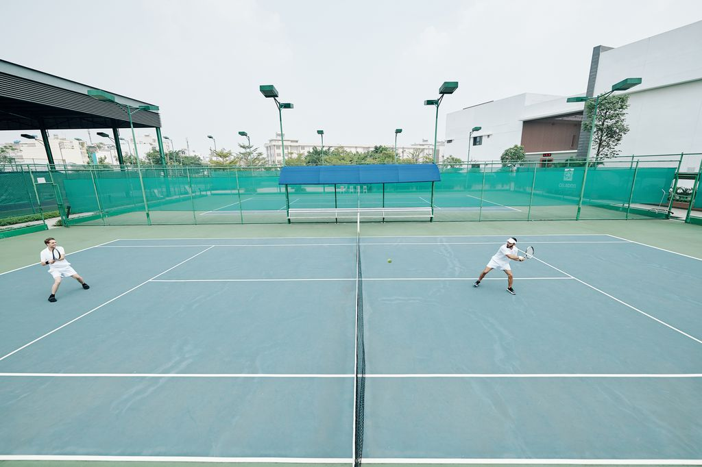

# Good/bad slide background classifier

## Overview
The pipeline for training a classifier for photos based on whether the photo is suitable as a slide background.  
Unattractive photos, photos with text, photos with people's faces, and so on are considered bad. Initially, the training set was collected by a qualified expert.  
For this task, the accuracy of determining a good background is more important than completeness, as there are plenty of candidates for backgrounds.  

#### Examples
The images on the left are not suitable as slide backgrounds because the slide text may overlap with the text in the image or cover large faces, making the slides look bad.  
The images on the right do not have these drawbacks and therefore represent good backgrounds.
<p>
  
  
  
  
</p>

## Usage
1) Install dependencies
```bash
$ pip install -r requirements.txt
```
2) Configure parameters in `config.py`
3) Start train
```bash
$ python train.py
```
4) For prediction on test data
```bash
$ python predict.py
```
for manual checking using gradio
```bash
$ python gradio_interface.py
```

## Experiments
The following experiments were conducted with training hyperparameters, and the best ones were selected:
* Loss: BCEWithLogitsLoss vs FocalLoss --> FocalLoss
* FocalLoss alpha: 0.25 vs 0.75 --> 0.75
* Model: Efficientnet vs Convnext vs Swin vs Vit --> Efficientnet
* Img size: 256 vs 512 --> 512
* Learning rate: 1е-3 vs 1е-4 vs 1е-5 --> 1е-4
* Augmentations: first kit vs second kit --> first kit
* Label smoothing: True vs False --> True

As a result, a model with F1=0.93 was trained.

## TODO
If the model's accuracy is not sufficient, a separate pseudo-class can be assigned to samples for which the model is not very confident, in order to manually check such labels later. Samples with high confidence can be added to the training set for active learning.
